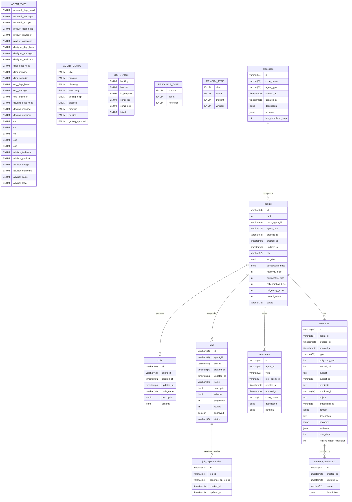

# DB

## Entity Relationship Diagram

```mermaid
erDiagram
    AGENT_TYPE {
        ENUM research_dept_head
        ENUM research_manager
        ENUM research_analyst
        ENUM product_dept_head
        ENUM product_manager
        ENUM product_assistant
        ENUM designer_dept_head
        ENUM designer_manager
        ENUM designer_assistant
        ENUM data_dept_head
        ENUM data_manager
        ENUM data_scientist
        ENUM eng_dept_head
        ENUM eng_manager
        ENUM eng_engineer
        ENUM devops_dept_head
        ENUM devops_manager
        ENUM devops_engineer
        ENUM ceo
        ENUM cto
        ENUM cfo
        ENUM coo
        ENUM cpo
        ENUM advisor_technical
        ENUM advisor_product
        ENUM advisor_design
        ENUM advisor_marketing
        ENUM advisor_sales
        ENUM advisor_legal
    }

    AGENT_STATUS {
        ENUM idle
        ENUM thinking
        ENUM planning
        ENUM executing
        ENUM getting_help
        ENUM blocked
        ENUM meeting
        ENUM helping
        ENUM getting_approval
    }

    JOB_STATUS {
        ENUM backlog
        ENUM blocked
        ENUM in_progress
        ENUM cancelled
        ENUM completed
        ENUM failed
    }

    RESOURCE_TYPE {
        ENUM human
        ENUM agent
        ENUM reference
    }

    MEMORY_TYPE {
        ENUM chat
        ENUM event
        ENUM thought
        ENUM whisper
    }

    processes {
        varchar(64) id
        varchar(32) code_name
        varchar(32) agent_type
        timestamptz created_at
        timestamptz updated_at
        jsonb description
        jsonb schema
        int last_completed_step
    }

    agents {
        varchar(64) id
        int rank
        varchar(64) boss_agent_id
        varchar(32) agent_type
        varchar(64) process_id
        timestamptz created_at
        timestamptz updated_at
        varchar(32) title
        jsonb job_desc
        jsonb background_desc
        int reactivity_bias
        int perspective_bias
        int collaboration_bias
        int poignancy_score
        int reward_score
        varchar(32) status
    }

    skills {
        varchar(64) id
        varchar(64) agent_id
        timestamptz created_at
        timestamptz updated_at
        varchar(32) code_name
        jsonb description
        jsonb schema
    }

    jobs {
        varchar(64) id
        varchar(64) agent_id
        varchar(64) skill_id
        timestamptz created_at
        timestamptz updated_at
        varchar(32) name
        jsonb description
        jsonb schema
        int poignancy
        int reward
        boolean approved
        varchar(32) status
    }

    job_dependencies {
        varchar(64) id
        varchar(64) job_id
        varchar(64) depends_on_job_id
        timestamptz created_at
        timestamptz updated_at
    }

    resources {
        varchar(64) id
        varchar(64) agent_id
        varchar(32) type
        varchar(64) rsrc_agent_id
        timestamptz created_at
        timestamptz updated_at
        varchar(32) code_name
        jsonb description
        jsonb schema
    }

    memory_predicates {
        varchar(64) id
        timestamptz created_at
        timestamptz updated_at
        varchar(32) name
        jsonb description
    }

    memories {
        varchar(64) id
        varchar(64) agent_id
        timestamptz created_at
        timestamptz updated_at
        varchar(32) type
        int poignancy_val
        int reward_val
        text subject
        varchar(64) subject_id
        text predicate
        varchar(64) predicate_id
        text object
        varchar(64) embedding_id
        jsonb context
        text description
        jsonb keywords
        jsonb evidence
        int start_depth
        int relative_depth_expiration
    }

    processes ||--o{ agents : "assigned to"
    agents ||--o{ skills : "possess"
    agents ||--o{ jobs : "assigned to"
    jobs ||--o{ job_dependencies : "has dependencies"
    agents ||--o{ resources : "uses"
    agents ||--o{ memories : "has"
    memories ||--o{ memory_predicates : "classified by"
```